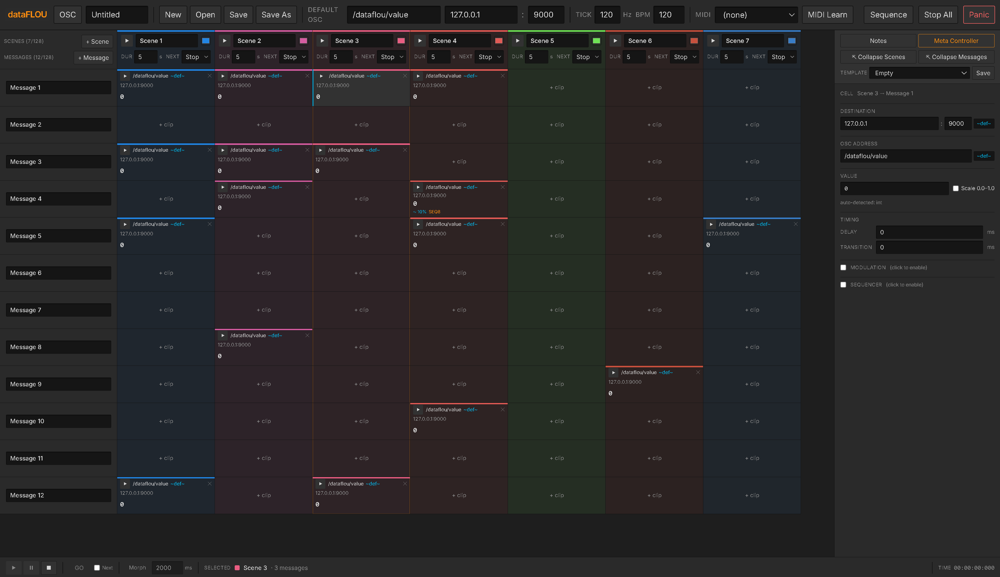

# dataFLOU_compositor

**Send OSC data to many destinations as triggerable scenes.** A rotated‑Ableton‑Session‑style editor that fires multiple OSC messages at once with optional modulation, sequencing, transitions, delays, MIDI control, and now an authorable **Pool of Instruments and Parameters** that mirrors the dataFLOU C++ library's vocabulary.



Built as a desktop app for Windows and macOS using Electron + React. Sessions are saved as plain JSON files and round‑trip cleanly between machines.

---

## What it does

You build a grid of **Instruments** (rows — each Instrument is a typed group of OSC **Parameters**) and **Scenes** (columns). Each cell at the intersection (a "clip") holds the value, modulation, sequencing, and timing parameters that this Parameter will use whenever this Scene is triggered. The big square at the **Instrument × Scene intersection** is a **group trigger** that fires every Parameter under the Instrument at once.

- **One scene trigger** fires every clip in that column simultaneously.
- **Per‑Parameter triggers** let you fire individual messages without launching the whole scene.
- **Per‑Instrument group trigger** at each Instrument × Scene intersection fires (or stops) every child Parameter's clip on that scene as a single gesture. MIDI‑learnable and shrinks down with the row when you collapse the Instruments column.
- **Pool drawer** — Built‑in / User tabs. Browse shipped Instrument Templates (OCTOCOSME, Generic XYZ, Pandore) and Parameter blueprints (RGB Light, Knob, Motor, Button, XY Pad), drag any onto the sidebar to instantiate. Author your own Templates + Parameter blueprints and they save with the session. Pop the Pool out into a draggable floating window for big libraries.
- **Multi‑value OSC** — space‑separated entries in a clip's Value field become multiple OSC args in a single message. Every modulator treats each entry independently.
- **Scale 0.0–1.0** — clamps each output channel to `[0, 1]`; with the Arpeggiator it proportionally normalizes the ladder instead of clipping.
- **Eight modulation types** — pick per clip: **LFO**, **Ramp**, **Envelope (ADSR)**, **Arpeggiator**, **Random Generator**, **Sample & Hold**, **Slew**, **Chaos** (logistic map). All share one clock-rate control (Free Hz or BPM-synced with dotted/triplet).
- **Sequencer (1–16 steps) with Euclidean mode** — classic step cycle, or **Euclidean**: N pulses distributed evenly across M steps with rotation.
- **Transitions** morph the previous clip's value into the new one over a configurable time, even while the LFO keeps running.
- **Ableton‑style follow actions** — Stop / Loop / Next / Previous / First / Last / Any / Other, plus a per‑scene **×Multiplicator**. Right‑click a scene (or multi‑selection) → **Set Follow Action** and the menu's submenu applies to every selected scene at once.
- **Sequence grid** — 1–128‑step drag‑laid sequence in the Sequence view. **Multi‑select scenes in the palette and drop a single drag** to fill consecutive Scene Steps next to each other in one gesture.
- **Timeline view** — alternate Sequence visualization where each occupied slot becomes a flex block whose width is proportional to its Duration. Live remaining-time on the playing segment + progress fill on every instance of the active scene. Toggle persists across view switches.
- **Live scene progress everywhere** — Scene Steps and Timeline both fill from 0 → 100% orange across the playing scene's duration, on every visual instance, so you can see exactly where you are even when the scene is placed in multiple slots.
- **Meta Controller** — **32 knobs across 4 banks** (A B C D). Each knob has a user name, min/max range, **Smooth (ms)** time, one of **14 output curves**, up to **8 OSC destinations** broadcasting simultaneously, and MIDI CC learn.
- **Cue system** — arm a scene as "next", fire it with **GO** / **Space** / MIDI. Optional auto‑advance to the next sequence slot after each GO.
- **Scene‑to‑scene Morph** — one knob in the transport glides every cell from scene A to scene B over N ms.
- **Pause freezes scene time** — Pressing Pause freezes the active scene's elapsed time; on Resume the countdown continues from where it was. Visual countdowns in Timeline + transport bar freeze in lockstep.
- **Show / Kiosk mode** — locks the UI into a performance view (F11, hold Escape to exit).
- **Autosave + crash recovery** — silent snapshot every 60 s to `~/AppData/Roaming/dataFLOU/autosave/`, keeps 30 rolling copies.
- **OSC monitor drawer** — bottom panel streams outgoing OSC in real time. Resizable via top‑edge drag handle. Toggle with **O**.
- **Transport bar** — always visible at the bottom: Play / Pause / Stop, cue GO, Morph enable + ms, **live HH:MM:SS:MS time counter** AND a **live remaining‑time pill** for the currently playing scene right next to it.
- **Clip Templates** — save full clip configs and apply them to empty cells.
- **Multi‑select clips** — Ctrl+click adds clips to a disjoint selection.
- **Multi‑select sequence slots** — Shift+click in the Scene Steps grid OR the Timeline extends a contiguous slot range. Right‑click → Clear Scene from N slots / Set Follow Action on every covered scene at once.
- **Global MIDI Learn** — one button. Click a scene, clip trigger, **Instrument group trigger**, or Meta knob, wiggle a MIDI control. Blue overlays show learnables, green = bound.
- **UI zoom** — Ctrl+wheel rescales everything below the main toolbar (0.5×–2×).
- **15 themes** — Studio Dark, Warm Charcoal, Graphite, Cream, Paper Light, plus the original 10. Bundled Inter / Roboto / Work Sans / IBM Plex Sans fonts.

OSC is sent over UDP. The engine runs in the Electron main process at a configurable tick rate (10–100 Hz) so timing stays stable even if the UI is busy.

---

## Quick start

### Run from source

Requires [Node.js](https://nodejs.org) (LTS or newer).

```bash
git clone https://github.com/filliformes/dataFLOU_compositor.git
cd dataFLOU_compositor
npm install
npm run dev          # launch in dev mode with hot reload
```

### Build a Windows installer

```bash
npm run build:win
```

Produces an installer under `release/<version>/dataFLOU_compositor-<version>-win-x64.exe` plus an unpacked `win-unpacked/` directory.

### Build a macOS dmg (must run on a Mac)

```bash
npm run build:mac
```

---

## How it's organized

The window is split into three regions:

| Region | What it holds |
| --- | --- |
| **Top toolbar** | **dataFLOU** brand button (preferences sub‑toolbar: Theme picker + Enter Show Mode), session name, file actions, default OSC, Tick rate, Global BPM, MIDI input picker, MIDI Learn, **Edit ↔ Sequence** view toggle, Stop All, Panic. |
| **Transport bar (bottom)** | Play / Pause / Stop (colored by active state), GO + auto‑advance toggle, Morph enable + ms, selected scene readout, **live HH:MM:SS:MS time + remaining‑time pill**. Always visible in both views. |
| **Meta Controller bar** | Toggled via the Inspector or **M** — sits below the main toolbar, resizable. |
| **Editor** (Edit view) | Left: Scenes/Instruments header (Add buttons + counts) and Instruments sidebar (Templates with their child Parameters indented under them). Each Instrument header has a `+PARAM` chip on its right side and a centered group‑trigger button at every Scene intersection. Center: Scene columns. Right: Inspector panel (toggleable with **I**) — top toggles for Notes / Meta Controller / Collapse Scenes / Collapse Instruments, then Clip Template dropdown when a cell is selected, then the clip's full parameters. |
| **Sequence view** | Left: resizable Scenes palette (200–1200 px, scenes wrap into multiple columns; pills auto‑size to their names) + a per‑scene inspector below it (toggleable with **S**). Center: 128‑slot Scene Steps grid OR Timeline visualization (toggle next to Clear mode), with progress fills + live time on every instance of the playing scene. Bottom: global transport bar. |

**Tab** toggles Edit ↔ Sequence — even from inside text inputs, dedicated to view‑switch only.

**Ctrl+wheel** zooms the whole app (except the main toolbar). **Left‑click** on either Collapse toggle flips just that axis; **right‑click** flips both.

---

## Concepts in detail

### Instruments + Parameters (rows)

The sidebar's vocabulary mirrors the dataFLOU C++ library: each row is either a **Template** (Instrument header) or a **Parameter** (child row that owns clips).

- **A new session opens with one Scene + one Instrument 1 with a child Parameter 1**, ready to send OSC.
- **+ Instrument** in the Scenes/Instruments header (or **Ctrl+T**) creates a new draft Template + one seeded child Parameter, all ready to instantiate.
- **`+PARAM`** chip on the right edge of each Instrument header (or **Ctrl+P** with the Instrument selected) adds another child Parameter to that group.
- **Right‑click a row** for: Add Instrument · Add orphan Parameter · Add Parameter to <X> · Save as Template · Show/Hide Pool · Delete (bulk if multi‑selected).
- **Right‑click in the blank space below the rows** for: Add Instrument · Add orphan Parameter · Show/Hide Pool.
- **Drag rows to reorder** them. Templates carry their child Parameters as a contiguous block; child Parameters are clamped to stay inside their parent's group.
- **Save as Template** (right‑click an Instrument header) flips the draft into a saved User Template in the Pool, re‑instantiable across sessions.

### Pool drawer

Toggle with **P** (also opens the OSC drawer if it's closed) or via the **Show Pool** entry in the Instruments right‑click menu.

- **Built‑in tab** — shipped library.
  - **Instruments**: OCTOCOSME (5 RGB rings + strip RGB), Generic XYZ pad, Pandore.
  - **Parameters**: RGB Light (v3 0–255), Knob (float 0–1), Motor (bipolar -1..1), Button (bool discrete), XY Pad (v2).
- **User tab** — your authored Instrument Templates + Parameter blueprints in the same scrollable list.
- **Drag any item onto the Edit‑view sidebar** to instantiate. Templates instantiate as a header row + every child Parameter under it; standalone Parameter blueprints become orphan Parameter rows (or get nested into an Instrument group if dropped inside one).
- **Click an item** to edit its full metadata in the right‑side Inspector — name, description, color, default IP : port, OSC base path, voices, plus the dataFLOU‑mirrored fields: `paramType`, `nature`, `streamMode`, `min/max/init`, `unit`, `notes`.
- **Pop out** the Pool (`⤢` button or fast double‑click on the title bar) into a centered floating window. **Drag the title bar** to move the floating window anywhere on screen. **Hide** to collapse the Pool inside the OSC drawer.

### Group triggers (Instrument × Scene)

Templates carry no clips of their own, so the cell at each Instrument header × Scene column intersection is a **centered Play/Stop button** that fires every child Parameter's clip on that scene at once.

- Click → triggers all children that have a clip on this scene.
- Click again (any child playing) → stops every active child of this Instrument on this scene.
- **MIDI‑learnable** — Global MIDI Learn → click the group trigger → wiggle a control. Bindings are stored per (sceneId, Instrument).
- **Shrinks** alongside the Instruments collapse toggle so the smallest possible Edit view stays compact.
- Greyed out when no child has a clip on this scene yet.

### Scenes (columns)

A Scene is a column. It has:

- A **name**, **color** (color picker), and **notes** (italic, toggle visibility globally via **Notes**).
- A **Duration** (0.5 – 300 s) and a **Next** follow‑action.
- A **×Multiplicator** (Sequence‑tab inspector only).
- A **Morph‑in (ms)** override.
- A **MIDI Learn** binding.
- A **trigger button** (top of column) that **fills clockwise over the scene Duration**.

#### Adding scenes

- **+ Scene** button in the palette header (or **Alt+S**).
- **+ Silence** button — adds a gray scene named "Silence" with no cells (no OSC fires) and `nextMode: 'next'` by default. Useful as a timed gap between two playable scenes.
- **Right‑click in the palette's blank area** → Add Scene · Add Scenes…  (the latter prompts for a count and creates that many at once).
- **Delete** key with one or more scenes selected → confirms, then removes (bulk‑aware in either view).

#### Selecting + dragging

- **Click** a palette pill to focus it.
- **Shift‑click** another to extend a contiguous range.
- **Drag** a pill into a Scene Step slot. **If the dragged pill is part of a multi‑selection, dropping fills consecutive slots** starting at the drop target — drop one drag, fill many slots.
- After a drop, the **Duration field auto‑focuses + selects** so you can immediately type a new duration without clicking the input.

### Sequence view

A 1 – 128 slot grid (configurable via the **Scene steps** input at the top) for laying out scenes in playback order. Left column is user‑resizable (200 – 1200 px).

- **Scene Steps grid** — 16 columns by default; with > 72 scenes, cells shrink to 28 px min width so the grid still fits in narrow windows.
- **Timeline view** (toggle next to Clear mode) — each occupied slot becomes a horizontal block whose width is proportional to its Duration. Click a segment to highlight it; the segment that's currently playing gets a separate accent ring + live `Xs left` readout in its corner. Toggle persists across view switches.
- **Click a scene** in either view to focus it in the inspector AND mark the slot as "selected" — Transport Play uses the selected slot as the start point.
- **Shift+click** a scene in either view to extend a contiguous slot multi‑selection (separate from the palette's selection — the two views can have independent selections).
- **Right‑click a slot or Timeline segment** → menu with **Clear Scene** and **Set Follow Action ▸** submenu. Multi‑selection acts on every selected slot at once (clears all / sets follow action on every covered scene).
- **Drag a slot** to swap its content with another slot.
- **Clear mode** — click any slot to empty it.
- **Live progress fill** — every instance of the currently playing scene fills orange from 0 → 100% across its Duration, in both Scene Steps AND Timeline.
- **Single‑instance highlight** — only the slot that fired (engine source‑slot tracking) gets the accent ring, even when the scene is placed in multiple slots. Progress fill still shows on every instance so you can see what's happening anywhere.

### Transport (bottom bar)

- **Play** — in **Sequence view**, starts the sequence transport from the selected slot (or from the first non‑empty slot if none is selected). **In Edit view**, plays the focused scene as a one‑shot. Play in Sequence view is dedicated to sequence transport — selecting a scene in the inspector does NOT cause Play to fire it.
- **Pause** — freezes auto‑advance AND freezes the active scene's elapsed time. The Timeline progress fill, palette countdowns, and the transport bar's remaining‑time pill all freeze in lockstep. On Resume, time picks up exactly where it left off.
- **Stop** — full stop, clears the slot selection so the next Play starts from the top.
- **Time** — running HH:MM:SS:MS counter, runs on Play, freezes on Pause, resets on Stop.
- **Scene remaining** — colored pill next to the Time, shows the current scene's color + dot + live `formatRemaining()` countdown. Updates at ~20 Hz; freezes during pause.
- **GO** + Next auto‑advance toggle.
- **Morph** enable + ms.

### Cue system

- **Arm** a scene three ways: right‑click → *Arm as next* · Alt‑click · press **A** with the scene focused.
- An armed scene shows a pulsing blue ring + `▶▶` chevron everywhere it appears.
- **Fire** with the **GO** button, **Space**, or a MIDI binding.
- **Next (auto‑advance arm)** — automatically arm the next non‑empty sequence slot after each fire.

### Scene‑to‑scene Morph

A single transport knob that turns every scene trigger from a snap into a glide. Per‑scene override + MIDI CC mapping (0..127 → 0..10 000 ms).

### Clips (cells)

Each clip carries the full per‑scene settings for one Parameter. Open a clip in the Inspector by clicking its tile.

- **Destination** (IP : port, with `~def~` link to session default), **OSC Address**, **Value** (auto‑detected at send), **Delay** + **Transition**.
- **Modulation** (collapsed by default): LFO / Ramp / Envelope / Arpeggiator / Random / Sample & Hold / Slew / Chaos.
- **Sequencer** (collapsed by default): 1–16 steps, Steps or Euclidean mode, BPM/Tempo/Free sync.

#### Visual cues

- **Trigger square solid orange** — clip is armed and held.
- **Clockwise orange sweep inside the square** — clip is modulating or sequencing.
- **Live value text in orange** in the cell tile — currently being modulated/sequenced.
- **Per‑step pulse** in the Inspector — flashes the current step at the sequencer rate.

### Templates & bulk actions

- **Right‑click an empty cell** → pick from saved Clip Templates.
- **With a clip selected**, the **Template** dropdown at the top of the Inspector applies templates or saves the current clip as a new template.
- **Ctrl‑click clips** to build a disjoint multi‑selection across any scene/parameter combination.
- **Apply template** → bulk‑apply across the selection.
- **Use Default OSC** → overwrite OSC address + destination on every selected clip with the session's current defaults.

### OSC monitor

A bottom drawer that streams outgoing OSC traffic for debugging.

- Toggle with **O** or right‑click the Instruments column → **Show Pool** (also opens the drawer).
- **Resizable** — drag the top edge to grow / shrink the drawer (120 – 600 px).
- Single‑line title bar — `× close · OSC Monitor · Log N/M · filter input · Live · Clear`.
- Filter by substring (any match on address or `ip:port`), pause, clear.
- Pool pane sits beside the log; each can be hidden independently.

### Autosave + crash recovery

- Silent snapshot every 60 s to `~/AppData/Roaming/dataFLOU/autosave/<name>-<timestamp>.dflou.json`.
- Keeps the most recent **30** copies.
- A `.running` sentinel detects unclean shutdowns; on next launch the app pops a **Restore from autosave?** modal.
- One final autosave fires on quit.

### Meta Controller

**32 knobs across 4 banks (A, B, C, D)** — 8 per bank. Toggled with **M** or via the Inspector. Per‑knob: name, min/max, smooth (ms), curve (14 shapes), MIDI CC binding, up to 8 OSC destinations.

### Show / Kiosk mode

Locks the UI into a performance view. Enabled from the preferences sub‑toolbar or with **F11**. Hides authoring chrome; keeps transport, GO button, scene palette, sequence grid, Meta Controller knobs. Exit by holding Escape ≥ 800 ms or pressing F11 again.

### Themes

15 built‑in themes (picker in the preferences sub‑toolbar). Studio Dark is the default. Bundled woff2 fonts so everything works offline.

---

## Sessions

Saved as plain JSON via the standard OS save dialog (suggested extension `.dflou.json`).

Contents:

- Session name, default OSC, global BPM, tick rate, sequence length
- All Tracks (Templates + Parameters with their kind/parent/source‑template links), per‑track defaults, MIDI bindings
- All Scenes (name, color, notes, duration, follow action, multiplicator, morph‑in, MIDI binding, **per‑Instrument group MIDI bindings**) and the cells inside them
- The 128‑slot sequence
- The Pool (Instrument Templates + Parameter blueprints, builtin entries dedup'd against the shipped library on load)
- Selected MIDI input device name
- Meta Controller bank state

The Save button **flashes blue** on a successful write. Old sessions migrate cleanly via `propagateDefaults()` — pre‑v0.4.0 single‑track sessions load as orphan Parameters with no parent.

---

## Keyboard shortcuts

| Shortcut | Action |
| --- | --- |
| **Tab** | Toggle Edit ↔ Sequence (works even inside text inputs — dedicated to view‑switch only) |
| **Space** | GO — fire the armed scene; if none, trigger the next non‑empty slot |
| **A** | Arm / unarm the focused scene as the next cue |
| **1 – 9 / 0** | Trigger scenes 1–10 in the sequence directly |
| **Enter** (in a clip's Value field) | Commit the new value AND re‑trigger the clip |
| **. / Shift + .** | Stop All (graceful) / Panic (instant) |
| **F11** | Toggle Show / Kiosk mode |
| **Esc** (hold ≥ 800 ms) | Exit Show mode |
| **M** | Toggle the Meta Controller bar |
| **O** | Toggle the OSC Monitor drawer |
| **P** | Toggle the Pool inside the OSC Monitor (opens drawer if closed) |
| **I** | Toggle the right‑side Inspector panel (Edit view) |
| **S** | Toggle the focused‑Scene info panel (Sequence view) |
| **Ctrl + S** *(Cmd + S on macOS)* | Save the current session (Save if path known, else Save As) |
| **Ctrl + T** *(Cmd + T on macOS)* | Add a new Instrument (draft Template + seeded Parameter) |
| **Ctrl + P** *(Cmd + P on macOS)* | Add a Parameter to the selected Instrument's group |
| **Alt + S** | Add a Scene |
| **Delete** | Multi‑selected Scenes (either view) → bulk delete; otherwise focused scene (Sequence) or selected Instrument(s) (Edit) |
| **Ctrl + wheel** | Zoom the whole app (except the main toolbar), 0.5×–2× |
| **Ctrl + drag** *(Cmd + drag on macOS)* a clip onto an empty cell | Duplicate that clip |
| **Ctrl + click** a clip | Add / remove it from the disjoint multi‑selection |
| **Shift + click** a scene (palette OR slot OR Timeline) | Extend range selection from the anchor (separate sets per view) |
| **Alt + click** a scene / palette pill / sequence slot | Arm that scene as the next cue (toggle) |
| **Right‑click** an empty cell | Open the Clip Template picker |
| **Right‑click** a filled clip (or multi‑selection) | Apply template / Use Default OSC |
| **Right‑click** a palette pill | Arm as next · Set Follow Action ▸ · Delete (bulk if multi‑selected) |
| **Right‑click** a Scene Step or Timeline segment | Clear Scene · Set Follow Action ▸ (bulk‑aware on slot multi‑selection) |
| **Right‑click** a scene column header | Arm · Set Follow Action chips · Delete (bulk) |
| **Right‑click** an Instrument row | Add Instrument · Add orphan Parameter · Add Parameter to <X> · Save as Template · Show/Hide Pool · Delete |
| **Right‑click** a Collapse toggle | Flip BOTH Collapse Scenes + Collapse Instruments together |
| **Double‑click** the Pool title bar | Pop the Pool out into a floating window (or dock back) |
| **Drag** the floating Pool's title bar | Move the floating window |
| **Shift + drag** a knob | Fine adjustment (×4 slower) |
| **Double‑click** a knob | Reset to 0 |

---

## Architecture

- **Electron 33 / electron‑vite / TypeScript / React 18 / Tailwind / Zustand**
- **Main process (Node)** — UDP sockets, scene engine, fixed‑tick LFO + sequencer, file I/O, autosave. Pure logic so timing stays stable independent of the UI. Engine reports `pausedAt` so renderer countdowns freeze visually in lockstep with engine pause.
- **Renderer process** — all UI, Web MIDI input handling, drag‑drop sequence grid (`@dnd-kit`).
- **Preload** — typed `window.api` bridge.

```
src/
├── main/
│   ├── engine.ts        # fixed-tick scene engine + OSC output (10–100 Hz)
│   ├── osc.ts           # UDP sender
│   ├── session.ts       # Save / Save As / Open + JSON I/O
│   ├── autosave.ts      # 60 s rolling snapshots + crash-recovery sentinel
│   └── index.ts         # window creation, IPC handler wiring
├── preload/
├── shared/              # types & factories used by main and renderer
│   ├── types.ts         # Session, Pool, ParameterTemplate, EngineState, MIDI binding shapes
│   └── factory.ts       # makeEmptySession, makeBuiltinPool, makeBuiltinParameters,
│                        # makeTemplateTrack, makeFunctionTrack, …
└── renderer/
    ├── components/
    │   ├── TopBar / TransportBar / OscMonitor / PoolPane / InstrumentsInspectorPane
    │   ├── EditView / TrackSidebar / SceneColumn (+ InstrumentTriggerCell) / CellTile / Inspector
    │   └── SequenceView (PaletteGrid + SlotCell + SequenceTimeline + TimelineSegment) / MetaControllerBar / MetaKnob / Modal / ResizeHandle / BoundedNumberInput
    ├── fonts/
    ├── hooks/useSceneCountdown.ts   # respects engine.pausedAt for pause-aware live time
    ├── store.ts                     # Zustand global state (session + UI state)
    ├── metaSmooth.ts                # renderer-side knob-value tweener
    ├── midi.ts                      # Web MIDI manager (handles instrument-group bindings too)
    └── styles.css
```

---

## Release notes — 0.4.1

A polish pass on top of v0.4.0 with two user‑reported papercuts fixed and a deeper authoring loop for clips that send multi‑arg OSC.

### Open dialog now actually loads
- **Open → click a saved session → it loads.** v0.4.0 silently swallowed a `ReferenceError` (`require is not defined`) inside `requestSessionLoad`, so the dialog closed and nothing changed. Replaced the dynamic `require` of the integrity‑check module with a static ESM import — Vite's renderer is ESM‑only and never had `require` at runtime.

### Ctrl+S saves
- **Ctrl + S** *(Cmd + S on macOS)* saves the current session. Behaves like the toolbar Save button: writes to the known file path, or prompts Save As if the session has never been saved. Briefly flashes the toolbar Save button on success. Suppressed inside text fields and in show mode.

### OCTOCOSME builtin retargeted at the software, not the hardware
- The shipped **OCTOCOSME** Instrument Template now targets port 1986 with 8 bundle Parameters that match the Pure Data show‑control patch's `list split 2` convention (2 prefix tokens + payload). Previously it was wired to the LED hardware itself, which was the wrong direction for show authoring.
- **Auto‑prefix** (`fixed` tokens in `argSpec`) is rendered next to the Value/Values title so you can see exactly what gets prepended without typing it into every cell.

### Schema‑driven multi‑arg editor
- Pool Parameters can now declare a typed list of args (`ParamArgSpec[]`) — name, type (`number | bool`), bounds, default, and an optional `fixed` prefix token.
- Cells inheriting an `argSpec` show a **Values** section (vs. the old single Value field) with one bounded numeric input per arg, labelled by name. Bool args render as numeric `[0, 1]` inputs (not checkboxes) so modulators can drive them.
- Each arg participates in modulation independently: LFO, Ramp, Sequencer, etc. all run per‑arg with one shared clock.
- Snapshot at instantiation: dragging a Pool Parameter onto the sidebar copies its `argSpec` onto the new Track, so editing the blueprint later doesn't retroactively rewrite live cells.

### Per‑Track enable / disable + per‑slot persistence
- **Click an Instrument row in the sidebar** to see its child Parameters listed in the Inspector with an **Enable** checkbox each. Cascades — disabling the Template silences every child.
- **Click a Parameter row** to see its current cell's values with a **pin** beside each one. Pinning freezes that arg to whatever value you typed in the Inspector at the moment you clicked the pin — modulation keeps running on the other args, the pinned arg emits the captured value forever until unpinned. Works through tick changes, scene morphs, and loop transitions.
- Disabled rows render at `opacity-40` everywhere they appear (sidebar + Scene cells) so it's obvious at a glance.

### Scene cells auto‑size to widest clip
- A Scene column is now `width: fit-content` with the widest cell setting the floor. Multi‑arg clips that previously truncated their value text now show the full value list inline.

### Track‑defaults auto‑inheritance
- Adding a clip to an Instrument‑Template‑instantiated row now **inherits the track's IP / port / OSC base path** instead of always falling back to the session default. Track defaults win → session defaults win → built‑in defaults win.

### Drop‑focus stickiness fix
- After dragging a Pool item onto the sidebar, clicking a Track name input now accepts keystrokes immediately. Previously you had to alt‑tab away and back. The drop handler now releases `document.activeElement` on the next animation frame.

---

## Release notes — 0.4.0

**The big merger toward Alex Burton's dataFLOU C++ library:** the editor now speaks the library's vocabulary natively. A flat row of Messages becomes a hierarchy of typed **Instruments** (Templates) holding **Parameters**, with a browseable **Pool** for shipped + user‑authored entries.

### Pool of Instruments + Parameters

- New **Pool drawer** inside the OSC monitor with **Built‑in / User** tabs.
- Built‑in library: 3 Instruments (OCTOCOSME, Generic XYZ, Pandore) + 5 Parameter blueprints (RGB Light, Knob, Motor, Button, XY Pad). All read‑only; duplicate to edit.
- Author your own Instrument Templates + Parameter blueprints; they save with the session.
- **Drag any item onto the sidebar** to instantiate. Templates expand to a header row + their child Parameters; standalone Parameters become orphan rows (or nest into a hovered Instrument group on drop).
- **Pop the Pool out** into a centered draggable floating window at ~30% screen size — useful when the library grows.
- **Hide** the Pool from the OSC drawer to give the OSC log full width; Show Pool button or **P** brings it back.
- Full Inspector form for both Templates and Parameter blueprints — `paramType` / `nature` / `streamMode` / `min/max/init` / `unit` / smooth / notes — mirroring `ParamMeta` so a future JSON import from Alex's library is mechanical.

### New sidebar vocabulary

- **Instruments** (Template rows) own **Parameters** (child rows). Old `Messages` terminology is gone from the UI.
- **+ Instrument** button + **Ctrl+T** create a draft Template with one seeded child Parameter (a fresh new session opens with exactly this).
- **+PARAM** chip on every Instrument header row + **Ctrl+P** add another child Parameter under that group.
- **Drag‑drop reorder** in the sidebar: Templates carry their child Parameter block as a unit; child Parameters clamp to their parent's group.
- **Right‑click** the sidebar (anywhere — row or empty space) for a context menu with all the authoring actions.
- Default new Instrument row height drops to the smallest non‑collapsed size so more rows fit on screen out of the box.

### Group triggers at every Instrument × Scene intersection

- The previously‑empty cell at each Template × Scene intersection is now a centered Play / Stop button.
- Click → fires every child Parameter clip on this scene.
- Active children → Stop turns them all off.
- **MIDI‑learnable** via Global MIDI Learn (new `instrument` learn target kind).
- Shrinks alongside the Instruments collapse toggle so the most‑compact Edit view still shows them.

### Timeline view

- Toggle next to Clear mode in the Sequence view; persists across Edit ↔ Sequence switches.
- Each occupied slot becomes a flex block whose width is proportional to its Duration.
- Click a segment to highlight it; right‑click for the same Clear / Follow Action menu the Scene Steps grid uses.
- Live progress fill on every instance of the playing scene + bottom‑right `Xs left` countdown on the actively‑playing instance.

### Sequence view polish

- **Scene palette**: pills hug their own names; the panel reflows into more columns as you drag the resize handle wider (now 200–1200 px). With > 72 scenes, the Scene Steps grid cells drop to 28 px min so the grid still fits narrow windows.
- **Multi‑scene drag‑drop**: select multiple palette pills (Shift+click) and dragging one drops all of them into consecutive Scene Steps next to each other.
- **Slot multi‑selection**: Shift+click in either Scene Steps OR Timeline extends a contiguous slot range. Right‑click → bulk Clear or bulk Set Follow Action across every covered scene.
- **Click a slot or Timeline segment** to focus that scene in the Inspector AND mark the slot as the Transport Play start point.
- **Click the blank palette area** to clear focus.
- **After a drop into Scene Steps**, the Duration field auto‑focuses + selects so you can immediately type a new duration.
- **Single‑instance highlight + every‑instance progress** — the engine source‑slot tracker means only the actually‑playing slot gets the accent ring, but the orange progress fill shows on every visual instance of the playing scene.
- **+ Silence button** — adds a "Silence" scene (no cells, gray, `nextMode: 'next'`) for clean delays between two playable scenes.
- **Add Scenes…** right‑click in the palette's blank area prompts for a count and creates that many at once.
- **Set Follow Action submenu** in every scene context menu — fly‑out with all eight modes; multi‑selection applies to all targeted scenes.

### Transport

- **Play in Sequence view** is now a **sequence transport** button — starts the sequence from the selected slot (or first non‑empty slot if none is selected). Selecting a scene in the inspector no longer makes Play fire it.
- **Pause freezes scene time**: engine tracks `pauseStartedAt` and shifts `activeSceneStartedAt` on Resume so elapsed picks up exactly where it left off. Renderer countdowns read engine `pausedAt` and freeze in lockstep.
- **Live remaining‑time pill** next to the main HH:MM:SS:MS counter — colored to match the playing scene, updates at ~20 Hz, freezes during pause.

### Inspector + UI toggles

- **I** toggles the Edit‑view right‑side Inspector panel.
- **S** toggles the Sequence‑view focused‑Scene info panel.
- **M** toggles the Meta Controller bar.
- **O** toggles the OSC Monitor drawer.
- **P** toggles the Pool (opens the OSC drawer first if it's closed).
- **OSC Monitor drawer is resizable** — drag the top edge to grow / shrink (120 – 600 px).
- Old "OSC Monitor + Pool" double title bar collapsed into a single strip.

### Smaller fixes

- "Collapse Messages" → **"Collapse Instruments"**.
- Default Instrument row height is now the smallest non‑collapsed size (60 px).
- Default empty session: 1 Scene + 1 Instrument with Parameter 1 + a pre‑populated cell.
- Right‑click on multi‑selected Scenes → **Delete N scenes?** in the menu, matching the Del key path.
- Right‑click on Instrument row blank space → just Add Instrument / Add orphan Parameter (cleaner menu).
- Pool name‑row chevrons 50% larger and bolder.
- Pool rows + buttons slimmed so > 4 fit in the default drawer height.
- BoundedNumberInput hardened — `strRef` to avoid stale‑closure on blur, parsed‑value vs external comparison, Enter/Escape commit/revert. Fixes intermittent Scene Steps + Duration edit getting stuck.
- CapsLock OSC monitor shortcut removed (use **O** instead).
- Tab is dedicated to view‑toggle — works inside text inputs too, no longer hands focus to the browser's Tab navigation.
- Scene drag overlay no longer forces minWidth: 140 — the floating preview matches the source pill's natural size.
- Engine no longer highlights every instance of an actively‑playing scene by default; only the source slot gets the ring.
- Live progress fill in palette pills + Timeline segments + Scene Steps slots, all at ~20 Hz, all freezing during pause.

---

## Release notes — 0.3.6

Three new modulators, Euclidean sequencing, and a stack of correctness + performance fixes.

### New modulators
- **Sample & Hold** — classic S&H with optional cosine-smoothed output and a `Probability` knob that holds samples across multiple clocks (Turing-Machine locked-in feel).
- **Slew** — random target at the clock rate, glides toward it with **independent rise/fall half-life** (1 ms – 60 s each).
- **Chaos** — logistic-map iteration (`r` 3.4 – 4.0). 3.83 hides the famous period-3 window.

### Euclidean sequencer
- New **Pattern: Steps (cycle) | Euclidean** selector. Euclidean exposes Pulses, Rotate, and a live preview row.

### Engine / correctness fixes
- **Follow actions finally work everywhere.** Engine re-reads the scene from the live session on every timer fire; falls back to the palette when the grid is empty.
- **Stop actually stops.** `Stop` morphs every armed cell to 0 and clears `activeSceneId`.
- **S&H smooth mode math fixed.** Cosine period was 2π instead of π.
- **Shutdown sequencing** consolidated into a single idempotent `shutdown()`.

### UI polish
- Next dropdown widened.
- MetaKnob memoized — smoother during MIDI CC sweeps and drag gestures.

---

## Release notes — 0.3.5

Live‑performance polish + new modulator + scene gliding.

- **Cue system** (arm + GO + auto‑advance), **Scene Morph**, **Show / Kiosk mode**, **Global transport bar** with HH:MM:SS:MS counter.
- **Ramp** modulator (one‑shot 0 → target with curve, free / synced / freeSync sync modes), **Envelope Free (synced)** mode.
- **Autosave + crash recovery** (60 s rolling snapshots, 30 copies, `.running` sentinel).
- **OSC monitor drawer**.
- **Meta Controller expanded to 32 knobs / 4 banks**.
- Windows freeze fix (rate‑limited stderr), session updateSession IPC coalesced on rAF, root‑level ErrorBoundary.

---

## Release notes — 0.3.0

- **Meta Controller** bank — 8 knobs, 14 curves, per‑knob smoothing, MIDI CC learn, up to 8 OSC destinations.
- **Ableton‑style follow actions** + per‑scene **×Multiplicator**.
- **Multi‑select** everywhere — Shift‑click for scene/message range, Ctrl‑click for disjoint clip selection.
- **5 new themes** (Studio Dark, Warm Charcoal, Graphite, Cream, Paper Light).
- **UI zoom** (Ctrl+wheel).
- **Scene inspector in Sequence view**.
- **Notes** toggle + adaptive sizing.

---

## Project status

A personal tool by [Vincent Fillion](https://vincentfillion.com), in active use. Out of scope for now:

- No undo / redo
- No MIDI output (MIDI is input‑only for triggering)
- No OSC bundles with timestamps
- No quantized scene changes (cue firing is immediate)

Issues and PRs welcome.

---

## License

ISC — do whatever you want, no warranty.
